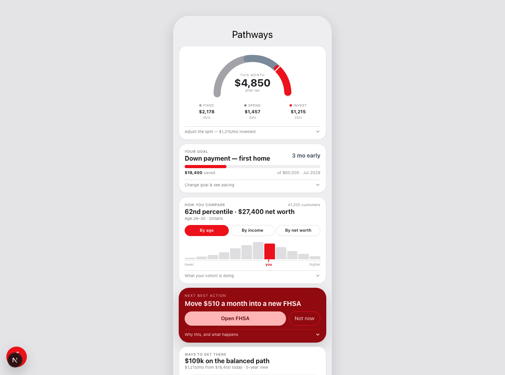
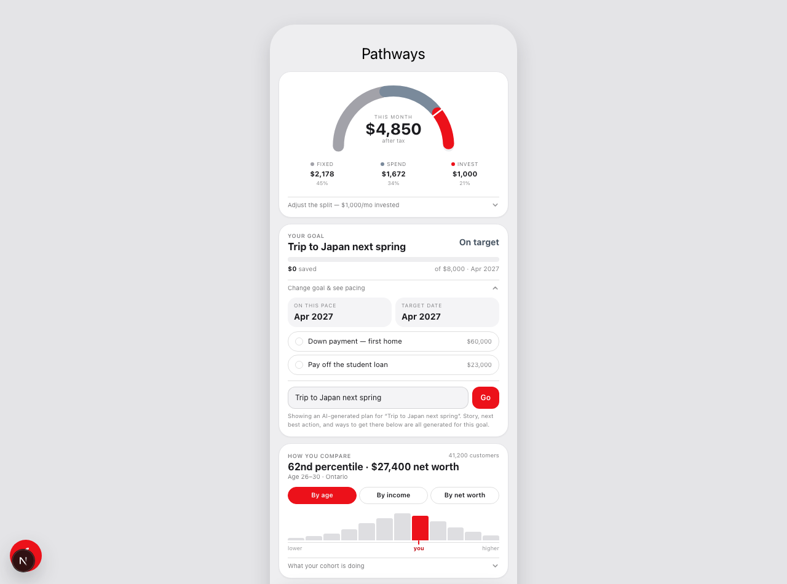
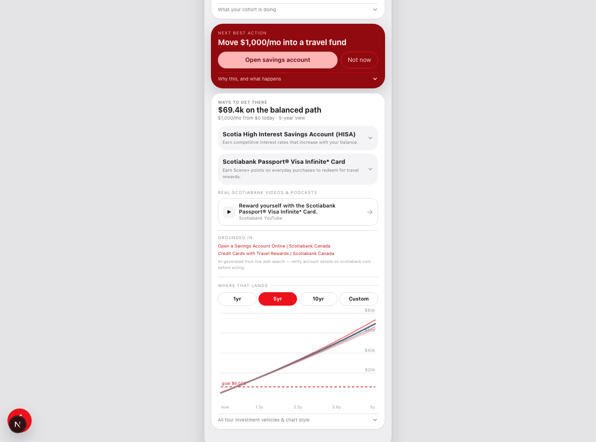

# Scotiabank Pathways

A mobile-first personal-finance dashboard concept for Scotiabank — built
with Next.js (App Router), React, the OpenAI API, and ElevenLabs. It shows a user's
monthly money split, progress toward a savings goal, how they compare to
peers, and a live, AI-generated plan for any goal they type in — and can
read the dashboard aloud.

## Screenshots

**Dashboard — money meter, goal tracking, peer comparison, next best action**



**Type any goal — a real OpenAI call plans it live**



**The plan is grounded in real Scotiabank products, videos, and sources**



## OpenAI integration

This is the headline feature: type any free-text goal (e.g. "Trip to Japan
next spring") into the "Change goal & see pacing" panel, and the app calls
OpenAI's [Responses API](https://platform.openai.com/docs/api-reference/responses)
server-side (`src/app/api/goal-plan/route.ts`) to generate a full plan for
it — live, not mocked.

- **Model**: `gpt-4.1` by default (override with `OPENAI_MODEL`).
- **Web search grounded**: the request enables the `web_search_preview`
  tool and instructs the model to search scotiabank.com for real
  account/product pages (FHSA, TFSA, RRSP, HISA, credit cards, etc.) and
  real Scotiabank YouTube/podcast content — it's told to return an empty
  array rather than invent a product, title, or URL.
- **Structured output**: the response is constrained to a strict JSON
  schema (`src/lib/goalPlan.ts`) covering a target amount, ETA, a "next
  best action" with a suggested monthly contribution, 2–3 real Scotiabank
  product recommendations with pros/cons, up to 4 real media items, and
  the source pages the plan was grounded in.
- **Self-consistent numbers**: the prompt requires `targetAmount`,
  `etaMonths`, and the suggested monthly contribution to agree with each
  other, and to be realistic against the user's stated income.
- Once a plan comes back, the whole dashboard — goal card, next best
  action, recommendations, projection chart — re-renders around it.

## ElevenLabs integration

The round speaker button in the bottom-right corner reads a short summary
of the dashboard aloud (goal progress, ETA, peer percentile, next best
action) using ElevenLabs text-to-speech. Tap the pencil above it to type
your own text instead.

- **Server route**: `src/app/api/speak/route.ts` calls ElevenLabs'
  [text-to-speech API](https://elevenlabs.io/docs/api-reference/text-to-speech)
  with the `eleven_turbo_v2_5` model and streams the MP3 back, so the API
  key never reaches the browser.
- **Voice**: "Rachel" by default (override with `ELEVENLABS_VOICE_ID`).
- **Cost guard**: requests are capped at 2,000 characters.

## Other features

- **Money meter** — a donut gauge of the monthly split across fixed
  costs, spending, and investing, with tap-to-focus slices and a
  contribution slider.
- **Your goal** — progress bar, ETA, and two built-in presets (down
  payment, debt payoff) alongside the AI custom-goal flow above.
- **How you compare** — percentile ranking and a peer distribution chart,
  split by age / income / net worth.
- **Next best action** — a single suggested action with idle / done /
  skipped states.
- **Ways to get there** — recommendation cards, a horizon picker (1yr /
  5yr / 10yr / custom), and a savings projection chart with three chart
  style variants.

## Tech stack

- [Next.js](https://nextjs.org) 16 (App Router, Turbopack)
- React 19 + TypeScript
- Tailwind CSS 4
- [OpenAI API](https://platform.openai.com) (`openai` SDK, Responses API + web search)
- [ElevenLabs](https://elevenlabs.io) text-to-speech

## Getting started

```bash
npm install
npm run dev
```

Open [http://localhost:3000](http://localhost:3000) in your browser.

### Enable the AI features

```bash
cp .env.example .env.local
```

Fill in `.env.local`:

```
OPENAI_API_KEY=sk-...
OPENAI_MODEL=gpt-4.1   # optional, this is the default
ELEVENLABS_API_KEY=...
ELEVENLABS_VOICE_ID=   # optional
```

Restart `npm run dev` after editing it. Without keys, the rest of the
dashboard still works — the goal planner and read-aloud button just show
an error instead.

## Project structure

```
src/app/                    Next.js routes (page, layout, /api/goal-plan, /api/speak)
src/app/api/goal-plan/      Server route that calls OpenAI and returns a GoalPlan
src/app/api/speak/          Server route that calls ElevenLabs and streams back audio
src/components/             The dashboard UI (PathwaysPhone + SpeakButton)
src/lib/                    Mock data, palette, types, and the goal-plan JSON schema
public/                     Static assets
```

## Status

This is a prototype / demo — most dashboard data is mocked
(`src/lib/data.ts`), and there's no backend or persistence beyond the
live OpenAI and ElevenLabs calls.

## Author

Built by [Karen Lin](https://github.com/KarenL24) for SHacks 2026.
